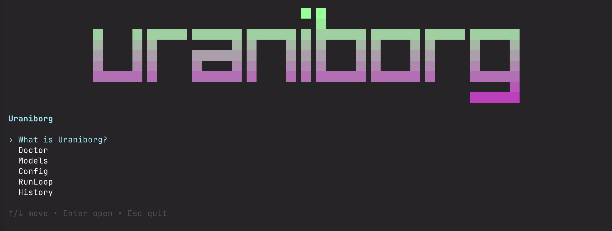

# Uraniborg



Researchers rarely publish the first version of an idea.

They submit a draft, receive hard objections, revise the argument, defend what should not change, and repeat until the work is stronger. This workflow is battle-tested, but the bottleneck is simple. _It is not scalable_. 

Uraniborg provides a reasonable proxy workflow by providing an agentic harness: a set of deep research agents review an idea, spawn web search, and conduct lit review in `alphaXiv`. A separate `revision` model refines the idea based on the critique it was handed to by the deep research agents. An over-arching memory layer preserves the decisions that should survive future iterations and prevent unintended regressions.

TLDR: Uraniborg is a local-first CLI for turning a Markdown research draft into a disciplined peer-review and revision loop.

```text
draft -> review -> refine -> remember -> repeat -> final draft
```

## Install

```bash
npm install -g @perpetual-lm/uraniborg
```

Uraniborg uses Feynman as its review-side backend and is built on top of it. Install it separately:

```bash
npm install -g @companion-ai/feynman@latest
```

Then verify the local environment:

```bash
uraniborg doctor
```

## Why Uraniborg?

In a lot of cases, you simply cannot manifest a focused, human-driven peer-review process. That's where we lose our lightbulb moments. We burn midnight fuel with a chatting agent with some arbitrary prompts, and before you know anything - you have filled yours and the LLM's context with noise.  

To formalize, a serious research revision loop has two failure modes:

- The draft is not challenged hard enough.
- Later revisions accidentally undo earlier decisions.

Uraniborg is opinionated around both problems. It completely decouples review from refinement thus removing any bias, records each iteration as local artifacts, and maintains an Information Highway: a running memory of accepted changes, unresolved challenges, and course corrections. The goal is not to make a draft longer. The goal is to make the argument harder to break.

## How It Works

### 📖 Review

Feynman reads the current draft and produces a structured critique: weak claims, missing evidence, unclear framing, and places where the argument should be challenged.

### 🏛️ Refine

Uraniborg sends the draft, the review, and the accumulated memory to the configured revision model. The refiner updates the draft while respecting decisions from prior iterations.

### 🧠 Remember

After each iteration, Uraniborg carries forward the important decisions from the review and refinement. This is the anti-regression layer: the next pass should not rediscover the same critique, undo a defensible correction, or lose track of unresolved tensions.

### 🔎 Inspect

History is available from the terminal, and a selected run can be opened as a local HTML reader for deeper review.

## Quickstart

Configure Uraniborg:

```bash
uraniborg init
```

Check review and revision model readiness:

```bash
uraniborg models
```

Run one review/refinement iteration on a Markdown draft:

```bash
uraniborg run path/to/draft.md --iterations 1
```

List previous runs:

```bash
uraniborg history
```

Open a selected run in the browser:

```bash
uraniborg history --web <run-id>
```

Resume an interrupted run:

```bash
uraniborg resume <run-id>
```

## What You Get

Each run gives you a durable trail of the draft's evolution:

- the original draft
- the critique for each iteration
- the refined draft for each iteration
- the final refined draft
- a browser reader for reviewing one run without terminal clutter

The important point is continuity. Uraniborg does not treat each revision as a fresh rewrite; it preserves the context needed to make later revisions build on earlier ones.

## Requirements

- Node.js `>= 20`
- npm
- `feynman` available on `PATH`
- revision-provider credentials configured through `uraniborg init`

Uraniborg does not bundle or own Feynman. Review-side provider setup, AlphaXiv access, and web-search readiness remain Feynman responsibilities; Uraniborg reports those readiness states through `doctor` and `models`.

## Gratitude

Uraniborg exists because of [Feynman](https://www.feynman.is/) and [Pi](https://pi.dev/). Their work provides the foundation that makes this project possible.
